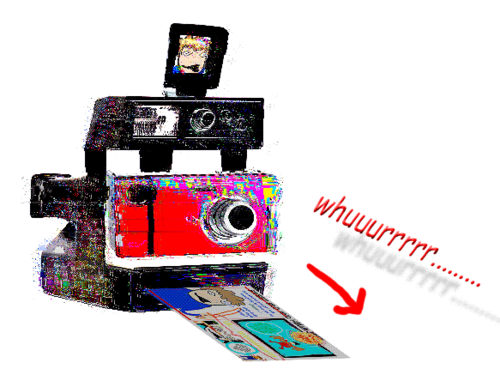

# [SBAHJifier][Chrome extension page]

Make any page look like [SWEET BRO AND HELLA JEFF][].

"Dave: Combine brain and SBaHJ drawing and chrome extension."
([relevant comic page](https://www.homestuck.com/story/1845))

Install the extension for [Chrome][Chrome extension page] or [Firefox][Firefox addon page].

[][Chrome extension page]

## See Also

- [She hass the rock?][She has what?]: Doctor Scritchy's Yelly-Angertext Imagemationmaker
- [Pesterchum][]: Recreation of the Homestuck "Pesterchum 6.0" UI

## License

The code is licensed under the MIT License. See [LICENSE.md](LICENSE.md).

[She has what?]: https://github.com/1j01/she-has-what?
[Pesterchum]: https://github.com/1j01/pesterchum
[Chrome extension page]: https://chrome.google.com/webstore/detail/sbahjifier/gejobhmmpioknjihlhemplpfchbnbpin
[Firefox addon page]: https://addons.mozilla.org/en-US/firefox/addon/1j01-sbahjifier/
[SWEET BRO AND HELLA JEFF]: http://www.mspaintadventures.com/sweetbroandhellajeff/
